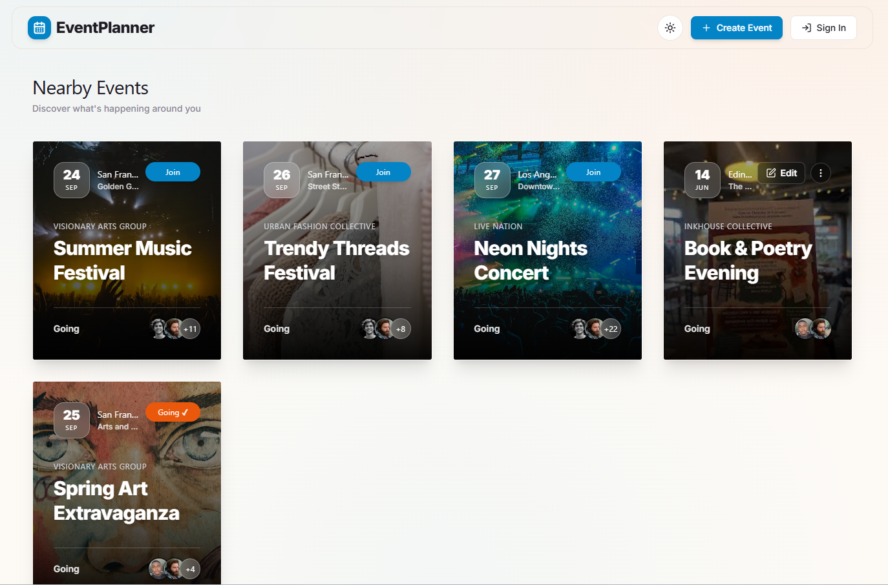
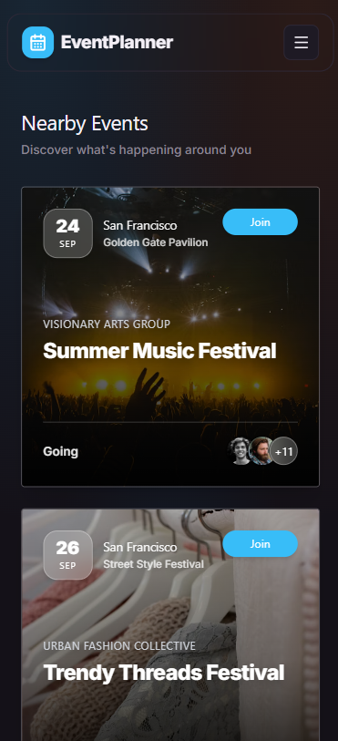
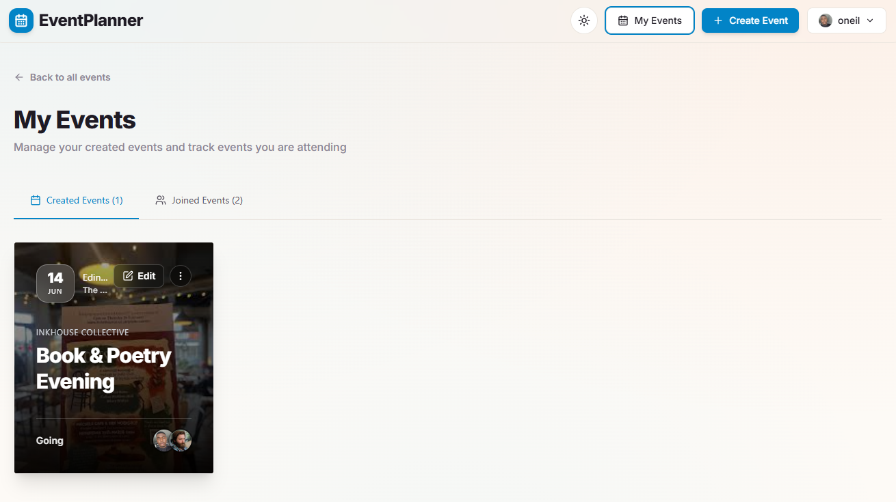
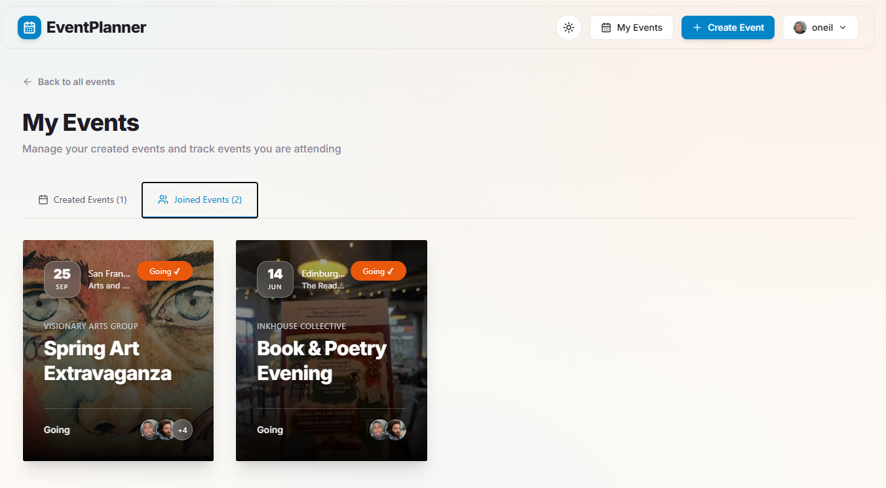
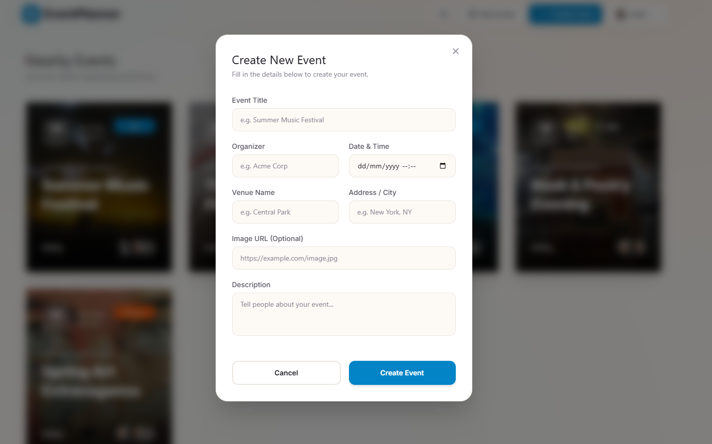
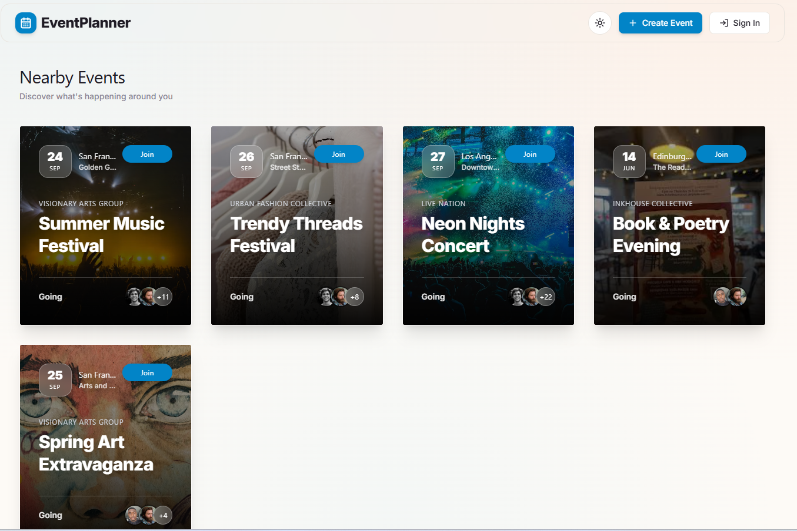
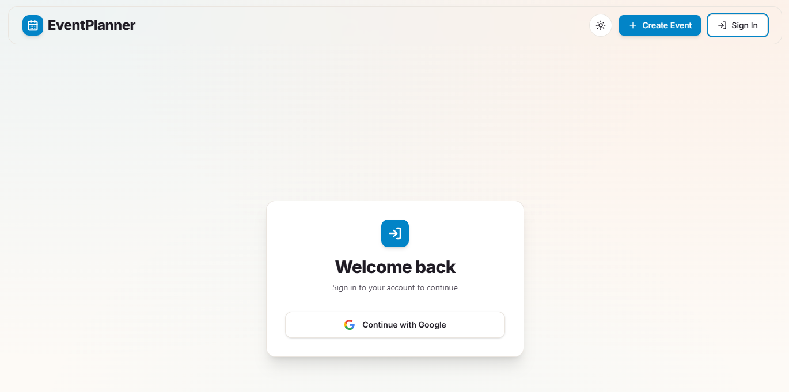

# 🎉 Event Planner

> A modern, full-stack web application built to explore the depths of the Next.js App Router, Server Actions, and relational databases.

[](https://nextjs.org/)
[](https://www.prisma.io/)
[](https://tailwindcss.com/)
[](https://better-auth.com/)

**[Live Demo: Event Planner on Vercel](https://event-planner-rbkn.vercel.app/)**

---

## 📖 About The Project

As a developer transitioning from frontend React to full-stack development, I built this application to push beyond UI components and truly understand the backend ecosystem.

While I was already comfortable with React and Next.js Server Components, this project was a deep dive into **Server Actions, data fetching/revalidation, robust authentication, and relational database modeling.** It forced me to understand the complete request lifecycle and data flow, resulting in immense technical growth.

### 📸 Screenshots

### Theme

- Light Mode
  

- Dark Mode
  

<br>
<br>
<br>

### Dashboard




<br>
<br>
<br>

### Event Creation



<br>
<br>
<br>


- ### Authentication Flow
  
  

<br>
<br>
<br>

---

## ✨ Key Features

- **Secure Authentication & Sessions:** Integrated seamless Google OAuth using Better Auth, ensuring secure and persistent user sessions.
- **Event Ownership & Management:** Users can seamlessly create, edit, and delete their own events. The app enforces strict authorization so users can only modify data they own.
- **RSVP & Attendee Tracking:** Users can join or leave events with a single click. The UI instantly updates attendee avatars and counts, synchronizing the "Join" status across the entire application.
- **AI-Accelerated Workflow:** Leveraged AI tools efficiently during development to research bleeding-edge libraries, troubleshoot complex integrations, and maintain a high development velocity.

---

## 🛠️ Tech Stack

- **Framework:** [Next.js 16](https://nextjs.org/) (App Router)
- **Database & ORM:** SQLite with [Prisma v7](https://www.prisma.io/)
- **Authentication:** [Better Auth](https://better-auth.com/)
- **Styling:** [Tailwind CSS v4](https://tailwindcss.com/) & [DaisyUI](https://daisyui.com/)

---

## 🧠 Technical Journey & Challenges

Building this project wasn't just about assembling tools; it was about solving real integration challenges. Here are a few key takeaways:

1. **Adopting the Bleeding Edge (Prisma v7 + Better Auth):**
   Since Prisma v7 was recently released, there were very few tutorials or community resources available. Successfully configuring the database schema and making the Better Auth Prisma adapter work flawlessly required patience, reading source code, and careful debugging.
2. **Mastering the Full-Stack Flow:**
   Transitioning from traditional client-side fetching to Next.js Server Actions completely changed how I approach data mutation. Learning when to use `revalidatePath` to keep the UI in sync with the database was a major "aha!" moment.

3. **Complex State Synchronization:**
   Ensuring that a user's RSVP status (e.g., clicking "Count Me In") updated instantly on both the event card and the detailed event page required careful UI state management to prevent jarring page reloads or mismatched data.

---

## 🚀 Getting Started (Local Development)

To run this project locally, follow these steps:

### Prerequisites

- Node.js (v18 or higher)
- A Google Cloud Console account (for OAuth credentials)

### Installation

1. **Clone the repository:**

   ```bash
   git clone https://github.com/yourusername/event_planner.git
   cd event_planner
   ```

2. **Install dependencies:**

   ```bash
   npm install
   ```

3. **Environment Variables:**
   Create a `.env` file in the root directory and add the following:

   ```env
   # Database
   DATABASE_URL="file:./dev.db"

   # Better Auth (Next.js)
   BETTER_AUTH_URL="http://localhost:3000"
   BETTER_AUTH_SECRET="generate-a-random-secret-string"

   # Google OAuth Credentials
   GOOGLE_CLIENT_ID="your-google-client-id"
   GOOGLE_CLIENT_SECRET="your-google-client-secret"
   ```

4. **Database Setup:**
   Generate the Prisma client and push the schema to your local SQLite database:

   ```bash
   npx prisma generate
   npx prisma db push
   ```

   _(Optional)_ Seed the database with sample data:

   ```bash
   npm run prisma:seed # (or whatever your seed script is)
   ```

5. **Run the development server:**
   ```bash
   npm run dev
   ```
   Open [http://localhost:3000](http://localhost:3000) in your browser to view the application.

---

_Designed and built by O'Neil Obidiaso._
